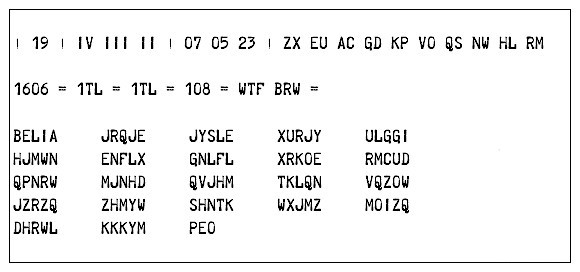
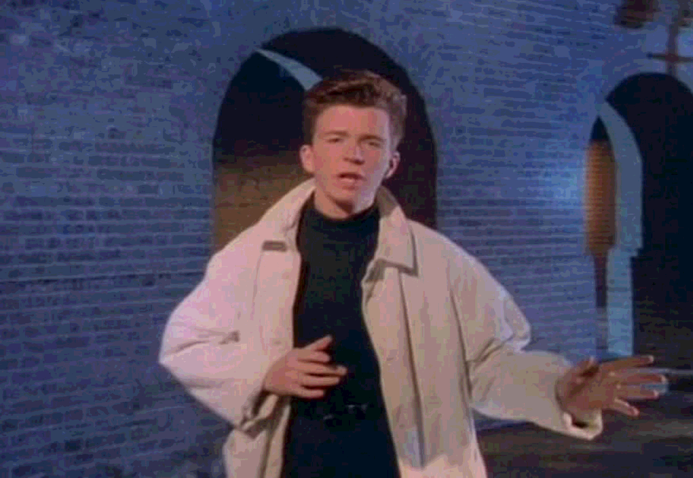

# Steganography

Usage: run `steganography.py` from terminal with a required argument of a path to an image file and an optional argument of a path to another image file or a text file. If one argument is given, the program will assume it already has encoded information and will decode it. If two arguments are given, the program will encode data from the second argument into the first image. The encoded/decoded image or decoded text file is saved to the root folder.

Example:
```
>> python steganography.py cover_image.jpg text_to_hide.txt
```
Output:
```
cover_image_hidden.bmp
```
---
# How Spies Rickroll Each Other

>ste·ga·no·graph·y  
> \ ˌste-gə-ˈnä-grə-fē \  
>noun
>
>the art or practice of concealing a message, image, or file within another message, image, or file

---

During World War II, the Allies intercepted German messages looking like this:



They asked their best cryptographers to work on decoding the hidden message, because obviously there's more to this than meets the eye. But if they had intercepted some Germans sending each other 1942 Instagrams, they probably wouldn't have bothered too much reading into it.


Just a picture of a forest? Or something more ominous…?

"Steganography" comes from the Greek word steganos, meaning "covered" or "reticent." Whereas cryptography concerns itself with hiding the contents of a message, steganography concerns itself with hiding the fact that's there's even a message at all, which discourages potential code-breakers from looking deeper.
This post is about a certain kind of steganography, termed Least Significant Bits (or LSB steganography). If I offered you $00000000 and said you could change just one digit of that number before I handed the cash over, only a fool would change the rightmost digit and request $00000001. It's pretty obvious that changing the leftmost digit results in $10,000,000, or *10 million dollars*, as compared to just a single dollar when changing the rightmost digit. Even though in both cases, we're changing just a single digit, the rightmost digit is the least significant because it has the smallest effect on the total. This is the same concept as LSB steganography.


---

One byte of data consists of 8 bits - eight digits of either 0 or 1, such as 00011010. If this byte represents the color of a pixel in an image, we could change the rightmost digit and only very imperceptibly change the color of that pixel. We can take our secret message and encode it in these least significant bits, so the overall image doesn't change much to the human eye and draws no attention to itself, and then extract these bits later to reveal the secret.


Here's a visual example. Colors on a computer screen can be represented by various balances of the colors red, green, and blue. This is called the RGB color model and each pixel can have a value between 0 and 255. In the palate above, the red square on the left is created from red, green, and blue pixel values of `R=240, G=64, B=64`. Converted to binary representation, these numbers are `R=11110000, G=0100000, B=0100000`. The next square to the right has the least significant bits of each color channel changed from 0 to 1, resulting in values of `R=11110001, G=0100001, B=0100001`. The square appears as exactly the same color as the first, and we've encoded 3 bits of information into that single pixel. The next square over has the 2nd least significant bit changed as well, resulting in values of `R=11110011, G=0100011, B=0100011`. Each square over has the next least significant bit changed, and you can see that it isn't clear that the color is changing until we get to the middle of the sequence (and then, it's only because we're able to compare it with the original value). By the time we get to the last square, and each bit in each byte of the red, green, and blue color channels has been switched, the color has completely changed. We're now at pixel values of `R=0000111, G=10111111, B=10111111`, or R`=15, G=191, B=191`, when converting back to integer values.
In order to encode the maximum amount of information into a pixel without changing it too much, I've chosen to discard the 4 least significant bits. So, to hide one image inside another, I take the 4 **most** significant bits of the cover image and the 4 **most** significant bits of the hidden image. I shift the 4 bits from the hidden image to the position of the **least** significant bits, and merge them with the 4 bits from the cover image. And, voilà!, the cover image hasn't appeared to have changed at all but it now contains the information necessary to reconstruct the hidden image.
Here's an animation showing the process:

[Steganography animation on Vimeo](https://vimeo.com/275159081)


We first loop through each pixel of the cover image (the red box, in the video above) and the hidden image (green) and for each pixel,
1. Convert the RGB values for each color channel to binary
2. Again for each channel, take the 4 most significant bits from the cover image and the 4 most significant bits from the hidden image
3. Shift the 4 bits from the hidden image to the positions of the least significant bits and combine them with the 4 bits from the cover image
4. Combine the RGB channels together to create a new pixel, dominated by the 4 significant bits from the cover image but with the 4 most significant bits from the hidden image encoded within. The color will change *slightly* due to the information hidden in the least significant bits (notice that the red square is now just *ever so slightly* oranger)
5. To decode the hidden image, take the 4 least significant bits from the new pixel and shift them back to the positions of the most significant bits
6. Fill in the vacated least significant bits with 0's (this is information we've forever lost due to the encoding)
7. The hidden image will now appear, slightly different than the original due to the lost data in the least significant bits (see, it's a bit darker)


---

Remember that image above, of the forest? It's got an image hidden inside it; I've already replaced all of the least significant bits with the most significant bits of a hidden image. So if I take that image, throw away the four most significant bits from each pixel and shift the least significant bits over, what appears? Rick Astley!


You've been rickrolled!

Without seeing the original pic of that forest (and even if you do!), it'd be very difficult to know that an image was hidden inside. I intentionally chose a "busy" image with lots of random lines and contrast because changes are more difficult to notice. The decoded pic of Astley though does show some artifacts from the loss of the least signifiant bits. Look at the image above; the smooth (so smooth!) skin of Astley's forehead and cheeks, as well as his jacket, show some posterization in the decoded image where colors abruptly shift without a smooth transition. You can also see in the bricks, particularly at the beginning of the arch above his right (your left) shoulder, where a lot of detail in the bricks is lost and they appear as one continuous color.


---

LSB steganography is a tool not just limited to spies. This technique is also used often by movie studios, for instance. When they need to send a movie to reviewers before releasing it to the public, they'll hide a watermark in some of the frames of the film. This watermark is specific to each recipient of an advance copy so if the film later shows up on The Pirate Bay, the movie studio simply needs to decode the hidden watermark from that copy to discover who had leaked it. Crucially, these hidden images can still be decoded if the image has been compressed - because the hidden image is just a "dimmer" version of itself (not quite correct, but just go with it), it'll still be there even if the image is resized, compressed, or cropped.

It's also possible to hide pure text inside another image with LSB steganography. Text requires a slightly different procedure though; the text is first converted to an array of bytes and each bit is sequentially overwritten into the least significant bits of an image. Because the order matters and each pixel contains a portion of the long string of bits, the image must be saved as a bitmap file and cannot be compressed (unless saved in a lossless format, such as in a .png), cropped, resized, enhanced, or any other procedure which would change the pixels. In contrast to hiding another image, where any change to the cover image will change but not corrupt the hidden image, when hiding text any change to the underlying pixel values will completely destroy the text. This obviously can be rather inconvenient with large amounts of text because the resulting bitmap file will be very large (I encoded the entire contents of War and Peace into a single image of 243 megabytes). Here is another version of the forest image which contains a much shorter string of text than War and Peace:


And what's hidden in this image?

> We're no strangers to love  
You know the rules and so do I  
A full commitment's what I'm thinking of  
You wouldn't get this from any other guy  
> 
> I just wanna tell you how I'm feeling  
Gotta make you understand  
> 
> Never gonna give you up  
Never gonna let you down  
Never gonna run around and desert you  
Never gonna make you cry  
Never gonna say goodbye  
Never gonna tell a lie and hurt you  
> 
> We've known each other for so long  
Your heart's been aching but you're too shy to say it  
Inside we both know what's been going on  
We know the game and we're gonna play it 
>
>And if you ask me how I'm feeling  
Don't tell me you're too blind to see  
>
>Never gonna give you up  
Never gonna let you down  
Never gonna run around and desert you  
Never gonna make you cry  
Never gonna say goodbye  
Never gonna tell a lie and hurt you  
Never gonna give you up  
Never gonna let you down  
Never gonna run around and desert you  
Never gonna make you cry  
Never gonna say goodbye  
Never gonna tell a lie and hurt you  
>
>Never gonna give, never gonna give  
(Give you up)  
(Ooh) Never gonna give, never gonna give  
(Give you up)  
>
>We've known each other for so long  
Your heart's been aching but you're too shy to say it  
Inside we both know what's been going on  
We know the game and we're gonna play it 
>
>I just wanna tell you how I'm feeling  
Gotta make you understand  
>
>Never gonna give you up  
Never gonna let you down  
Never gonna run around and desert you  
Never gonna make you cry  
Never gonna say goodbye  
Never gonna tell a lie and hurt you  
Never gonna give you up  
Never gonna let you down  
Never gonna run around and desert you  
Never gonna make you cry  
Never gonna say goodbye  
Never gonna tell a lie and hurt you  
Never gonna give you up  
Never gonna let you down  
Never gonna run around and desert you  
Never gonna make you cry  